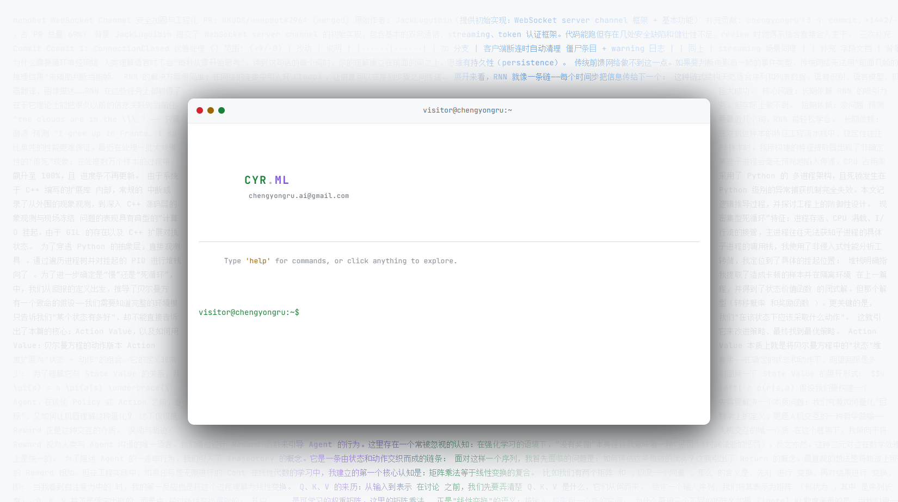

# shell.garden

A terminal-style blog template built with Astro, Preact, and Tailwind CSS.



Your blog, but it's a terminal. Visitors explore your content via command-line
(`ls`, `cd`, `cat`, `grep`, `tag`, `neofetch`...) with vim keybindings, 5 color
themes, and a three-body gravitational spotlight background.

## Quick Start

1. **Fork or clone** this repository
2. **Edit `src/config.ts`** — change all personal info to yours
3. **Replace `content/`** — add your own markdown notes
4. **Deploy** — push to GitHub Pages or any static host

## What to Customize

### `src/config.ts` (the only file you need to edit)

| Section | What it controls |
|---------|-----------------|
| `site` | URL, title, description, language |
| `terminal` | Brand name, hostname, email shown in banner |
| `neofetch` | System info displayed by the `neofetch` command |
| `dirs` | Directory names and descriptions for `ls` |
| `rss` | RSS feed title and description |

### Content

Place your markdown files in the `content/` directory. The directory structure
becomes the virtual filesystem visitors explore:

```
content/
  index.md          → About page (shown by `about` command)
  notebook/
    my-post.md      → /notebook/my-post
  diary/
    2025-01-01.md   → /diary/2025-01-01
```

Frontmatter schema:
```yaml
---
title: My Post
date: 2025-01-01
tags: [tag1, tag2]
draft: false
mathjax: true
---
```

## Features

- **15 terminal commands**: ls, cd, cat, grep, tag, recent, about, neofetch, help, clear, theme, whoami, echo, date, history, pwd
- **Vim keybindings** in the content viewer (j/k, Ctrl+d/u, G/gg, /, n/N, q)
- **5 themes**: Catppuccin Mocha, Dracula, Gruvbox Dark, Solarized Dark, GitHub Light
- **Markdown**: KaTeX math, Mermaid diagrams, Obsidian callouts & highlights, code highlighting
- **Three-body spotlight** background animation
- **Draggable & resizable** terminal window
- **Tab completion** with cycling
- **RSS feed** and SEO-friendly hidden article markup
- **Obsidian-compatible**: works as an Obsidian vault via git submodule

## Tech Stack

- [Astro](https://astro.build) — static site generation
- [Preact](https://preactjs.com) — interactive UI islands
- [Tailwind CSS v4](https://tailwindcss.com) — styling
- [KaTeX](https://katex.org) — math rendering
- [Mermaid](https://mermaid.js.org) — diagrams
- [Shiki](https://shiki.style) — code highlighting

## Commands

| Command | `npm run ...` |
|---------|---------------|
| Dev server | `dev` |
| Build | `build` |
| Preview | `preview` |
| Test | `test` |

## License

MIT
